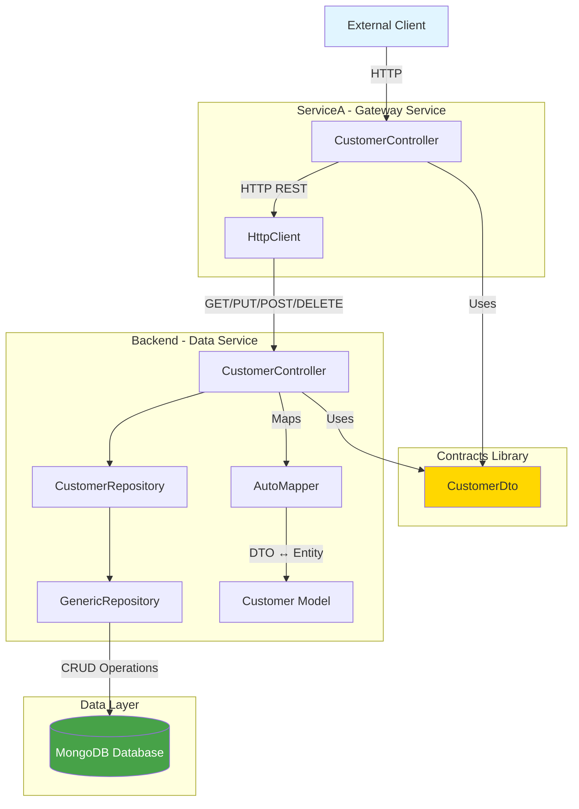
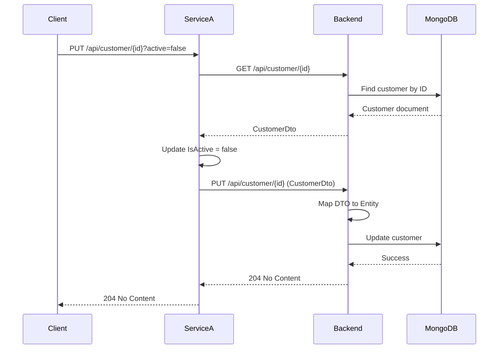

# TwoServices Architecture Documentation

## Table of Contents
- [System Overview](#system-overview)
- [Architecture Diagram](#architecture-diagram)
- [Projects](#projects)
  - [Contracts](#contracts)
  - [Backend](#backend)
  - [ServiceA](#servicea)
- [Communication Flow](#communication-flow)
- [Data Models](#data-models)
- [API Endpoints](#api-endpoints)
- [Technology Stack](#technology-stack)
- [Configuration](#configuration)

---

## System Overview

TwoServices is a microservices-based ASP.NET Core application demonstrating service-to-service communication, data persistence, and shared contract patterns. The solution consists of three projects:

1. **Contracts** - Shared data transfer objects (DTOs)
2. **Backend** - Data service with MongoDB persistence
3. **ServiceA** - Gateway/proxy service that communicates with Backend

### Architecture Pattern
- **Microservices Architecture**: Independent, deployable services
- **API Gateway Pattern**: ServiceA acts as a gateway/proxy to Backend
- **Shared Contracts**: Common DTOs in separate assembly
- **Repository Pattern**: Backend uses repository pattern for data access

---

## Architecture Diagram



---

## Projects

### Contracts

**Purpose**: Shared library containing Data Transfer Objects (DTOs) used for communication between services.

**Location**: `./Contracts/`

**Target Framework**: .NET 10.0

**Responsibilities**:
- Define shared data contracts
- Ensure consistent data structure across services
- Decouple service implementations from shared types

**Key Files**:
```
Contracts/
├── DTO/
│   └── CustomerDto.cs
└── Contracts.csproj
```

**CustomerDto Model**:
```csharp
public class CustomerDto
{
	public string Id { get; set; }
	public string Name { get; set; }
	public bool IsActive { get; set; }
}
```

**Dependencies**: None (standalone library)

**Consumed By**: Backend, ServiceA

---

### Backend

**Purpose**: Primary data service responsible for CRUD operations and MongoDB persistence.

**Location**: `./Backend/`

**Target Framework**: .NET 10.0

**Port Configuration**:
- HTTP: `http://localhost:5148`
- HTTPS: `https://localhost:7118`

**Responsibilities**:
- Manage customer data in MongoDB
- Provide RESTful API for customer operations
- Map between DTOs and database entities
- Implement resilience policies for database operations
- Validate MongoDB connection at startup

**Key Components**:

#### 1. Controllers
- **CustomerController**: REST API endpoints for customer operations

#### 2. Models
- **Customer**: MongoDB entity with BSON attributes
  - Fields: Id, Name, IsActive
  - Mapped to/from CustomerDto using AutoMapper

#### 3. Repositories
- **GenericRepository<T>**: Base repository with CRUD operations
- **CustomerRepository**: Specialized customer repository

#### 4. Services
- **MongoDbService**: MongoDB database connection management
- **MongoDbResiliencePolicy**: Resilience policies for MongoDB operations
- **MongoDbStartupValidator**: Validates MongoDB connection at startup

#### 5. Mappings
- **MappingProfile**: AutoMapper profile for Customer ↔ CustomerDto

**Project Structure**:
```
Backend/
├── Controllers/
│   └── CustomerController.cs
├── Models/
│   └── Customer.cs
├── Repositories/
│   ├── GenericRepository.cs
│   └── CustomerRepository.cs
├── Services/
│   └── MongoDbService.cs
├── Mappings/
│   └── MappingProfile.cs
├── Policies/
│   └── MongoDbResiliencePolicy.cs
├── Validators/
│   └── MongoDbStartupValidator.cs
├── Config/
│   └── MongoDbSettings.cs
└── Program.cs
```

**Dependencies**:
- MongoDB.Driver
- AutoMapper
- Contracts (project reference)

**Database**:
- **Type**: MongoDB
- **Connection**: `mongodb://localhost:27017`
- **Database**: `TwoServicesDb`
- **Collection**: `customers`

**Features**:
- ✅ Global exception handling middleware
- ✅ CORS enabled (allow all origins)
- ✅ AutoMapper for DTO/Entity mapping
- ✅ Resilience policies for MongoDB operations
- ✅ Startup validation for MongoDB connection
- ✅ Structured logging

---

### ServiceA

**Purpose**: Gateway/proxy service that provides specialized customer operations by communicating with Backend.

**Location**: `./ServiceA/`

**Target Framework**: .NET 10.0

**Port Configuration**:
- HTTP: `http://localhost:5234`
- HTTPS: `https://localhost:7111`

**Responsibilities**:
- Act as API gateway/proxy to Backend service
- Provide specialized endpoints (e.g., update customer activation status)
- Handle service-to-service communication
- Implement HTTP client patterns
- Swagger/OpenAPI documentation

**Key Components**:

#### 1. Controllers
- **CustomerController**: Proxy endpoints that call Backend API
  - **UpdateCustomer**: Update customer activation status

#### 2. Communication Pattern
- Uses `IHttpClientFactory` for HTTP client management
- Reads Backend URL from configuration
- Implements retry and error handling
- Logs all service-to-service communication

**Project Structure**:
```
ServiceA/
├── Controllers/
│   └── CustomerController.cs
├── Properties/
│   └── launchSettings.json
├── appsettings.json
├── appsettings.Development.json
├── ServiceA.http
└── Program.cs
```

**Dependencies**:
- Microsoft.AspNetCore.OpenApi
- Swashbuckle.AspNetCore (Swagger)
- Contracts (project reference)

**Configuration** (`appsettings.json`):
```json
{
  "BackendApi": {
	"BaseUrl": "http://localhost:5148"
  }
}
```

**Features**:
- ✅ HttpClient factory pattern
- ✅ Swagger UI enabled (auto-launch on startup)
- ✅ Global exception handling middleware
- ✅ Configuration-based Backend URL
- ✅ Comprehensive error handling
- ✅ Structured logging

---

## Communication Flow

### Service-to-Service Communication

#### Pattern: HTTP REST API

ServiceA communicates with Backend using standard HTTP/REST patterns:

1. **Client Request** → ServiceA
2. **ServiceA** → Creates HttpClient via IHttpClientFactory
3. **ServiceA** → Makes HTTP request to Backend
4. **Backend** → Processes request and accesses MongoDB
5. **Backend** → Returns response to ServiceA
6. **ServiceA** → Transforms/forwards response to client

### Example: Update Customer Activation Status



### Error Handling Flow

Both services implement comprehensive error handling:

1. **Try-Catch**: All external calls wrapped in try-catch
2. **HTTP Status Codes**: Proper status codes returned (200, 204, 400, 404, 500)
3. **Logging**: Errors logged with context
4. **Client Response**: Meaningful error messages returned

---

## Data Models

### CustomerDto (Contracts)
**Purpose**: Data transfer object for service communication

| Property | Type | Description |
|----------|------|-------------|
| Id | string | Unique customer identifier |
| Name | string | Customer name |
| IsActive | bool | Customer activation status |

### Customer (Backend Entity)
**Purpose**: MongoDB entity with database-specific attributes

| Property | Type | BSON Attribute | Description |
|----------|------|----------------|-------------|
| Id | string | _id | MongoDB document ID (GUID) |
| Name | string | name | Customer name (required) |
| IsActive | bool | active | Activation status (default: false) |

**Mapping**: AutoMapper handles bidirectional mapping between Customer and CustomerDto

---

## API Endpoints

### Backend API (`http://localhost:5148`)

#### Customer Endpoints

| Method | Endpoint | Description | Request Body | Response |
|--------|----------|-------------|--------------|----------|
| GET | `/api/customer` | Get all customers | - | 200: List\<CustomerDto\> |
| GET | `/api/customer/{id}` | Get customer by ID | - | 200: CustomerDto<br>404: Not Found |
| POST | `/api/customer` | Create customer | CustomerDto | 200: CustomerDto |
| PUT | `/api/customer/{id}` | Update customer | CustomerDto | 204: No Content<br>404: Not Found |
| DELETE | `/api/customer/{id}` | Delete customer | - | 204: No Content<br>404: Not Found |

### ServiceA API (`http://localhost:5234`)

#### Customer Endpoints

| Method | Endpoint | Description | Parameters | Response |
|--------|----------|-------------|------------|----------|
| PUT | `/api/customer/{id}?active={bool}` | Update customer activation status | id (route), active (query) | 204: No Content<br>404: Not Found |

**Swagger UI**: `http://localhost:5234/swagger`

---

## Technology Stack

### Backend
- **Framework**: ASP.NET Core 10.0
- **Database**: MongoDB 
- **ORM**: MongoDB.Driver
- **Mapping**: AutoMapper
- **Patterns**: Repository, Dependency Injection
- **Resilience**: Custom resilience policies

### ServiceA
- **Framework**: ASP.NET Core 10.0
- **HTTP Client**: IHttpClientFactory
- **Documentation**: Swagger/OpenAPI (Swashbuckle)
- **Patterns**: Gateway/Proxy, Dependency Injection

### Contracts
- **Type**: .NET Standard Library (.NET 10.0)
- **Purpose**: Shared DTOs

### Common
- **Language**: C# 10+
- **Runtime**: .NET 10.0
- **Logging**: Microsoft.Extensions.Logging
- **Configuration**: appsettings.json

---

## Configuration

### Backend Configuration

**appsettings.json**:
```json
{
  "MongoDbSettings": {
	"ConnectionString": "mongodb://localhost:27017",
	"DatabaseName": "TwoServicesDb"
  }
}
```

**Features Enabled**:
- Global exception handling
- CORS (allow all)
- AutoMapper
- MongoDB resilience policies
- Startup validation

### ServiceA Configuration

**appsettings.json**:
```json
{
  "BackendApi": {
	"BaseUrl": "http://localhost:5148"
  }
}
```

**Features Enabled**:
- HttpClient factory
- Swagger UI (auto-launch)
- Global exception handling
- CORS enabled

### Launch Settings

#### Backend
- Development profile: `http://localhost:5148`
- Browser launch: Disabled

#### ServiceA
- Development profile: `http://localhost:5234`
- Browser launch: Enabled (opens Swagger)

---

## Design Decisions

### Why ServiceA as a Gateway?
- **Separation of Concerns**: Frontend services separated from data services
- **Specialized Operations**: ServiceA can implement business logic without modifying Backend
- **Scalability**: Services can be scaled independently
- **Security**: Backend can be isolated from direct client access

### Why Shared Contracts?
- **Type Safety**: Compile-time verification of data structures
- **Consistency**: Same DTOs used by all services
- **Versioning**: Centralized contract management
- **Decoupling**: Services depend on contracts, not each other

### Why AutoMapper in Backend?
- **Clean Separation**: DTOs vs. Database entities
- **Maintainability**: Centralized mapping logic
- **Flexibility**: Easy to add computed properties or transformations

### Why MongoDB?
- **Document Model**: Flexible schema for customer data
- **NoSQL**: Suitable for microservices architecture
- **Performance**: Fast read/write operations
- **Scalability**: Easy horizontal scaling

---

## Future Enhancements

### Potential Improvements
- [ ] Add authentication/authorization (JWT, OAuth)
- [ ] Implement API versioning
- [ ] Add health check endpoints
- [ ] Implement distributed tracing (OpenTelemetry)
- [ ] Add service discovery (Consul, Eureka)
- [ ] Implement circuit breaker pattern in ServiceA
- [ ] Add caching layer (Redis)
- [ ] Containerize services (Docker)
- [ ] Add comprehensive unit/integration tests
- [ ] Implement message-based communication (RabbitMQ, Azure Service Bus)

### Monitoring & Observability
- Application Insights / Prometheus
- Structured logging (Serilog)
- Correlation IDs for request tracking
- Performance metrics

---

## Development Workflow

### Running the Solution
1. **Start MongoDB**: Ensure MongoDB is running on `localhost:27017`
2. **Run Backend**: `cd Backend && dotnet run`
3. **Run ServiceA**: `cd ServiceA && dotnet run`
4. **Access Swagger**: Navigate to `http://localhost:5234/swagger`

### Testing
- Use `.http` files for manual API testing
- Swagger UI for interactive testing
- Browser for GET requests (ServiceA only)

### Git Repository
- **Branch**: `develop`
- **Remote**: `https://github.com/etwas77/TwoServices`

---

**Last Updated**: 2024
**Version**: 1.0
**Maintainer**: Development Team
