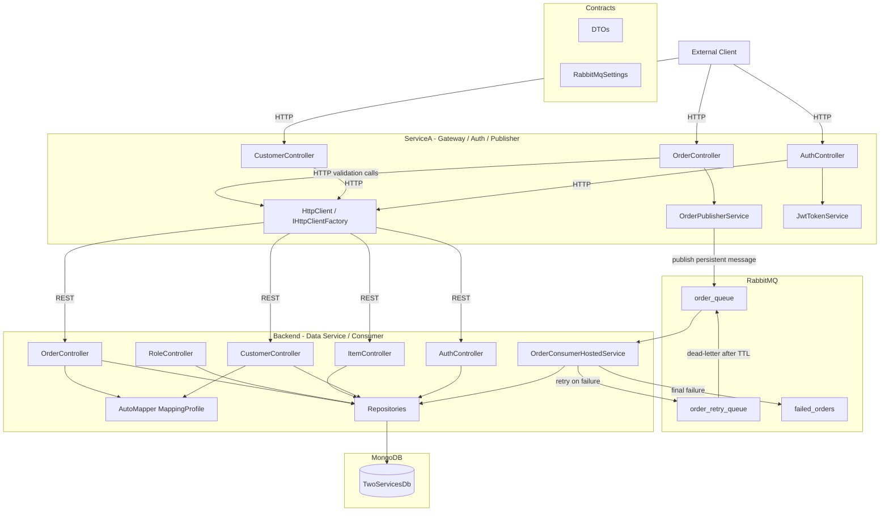

# TwoServices Architecture Documentation

## Table of Contents
- [System Overview](#system-overview)
- [Current Development State](#current-development-state)
- [Architecture Diagram](#architecture-diagram)
- [Projects](#projects)
  - [Contracts](#contracts)
  - [Backend](#backend)
  - [ServiceA](#servicea)
- [Communication Flows](#communication-flows)
  - [Synchronous HTTP flow](#synchronous-http-flow)
  - [Asynchronous RabbitMQ flow](#asynchronous-rabbitmq-flow)
- [Data and Messaging Models](#data-and-messaging-models)
- [API Surface](#api-surface)
- [Configuration](#configuration)
- [Technology Stack](#technology-stack)
- [Known Development Notes](#known-development-notes)

---

## System Overview

TwoServices is a small microservices solution built with ASP.NET Core and MongoDB. It currently demonstrates two integration styles:

1. **Synchronous service-to-service HTTP calls**
2. **Asynchronous message-based processing with RabbitMQ**

The solution consists of three projects:

1. **Contracts** - shared DTOs and shared RabbitMQ configuration model
2. **Backend** - MongoDB-backed data service and RabbitMQ consumer
3. **ServiceA** - gateway/auth service, HTTP proxy, and RabbitMQ publisher

### Main architectural roles

- **Contracts** defines transport models shared by both services.
- **Backend** owns persistence, repository abstractions, AutoMapper mappings, authentication data, and message consumption.
- **ServiceA** stays client-facing: it issues JWTs, proxies selected Backend operations, validates order inputs via Backend APIs, and publishes orders to RabbitMQ.

---

## Current Development State

The solution is no longer just a basic customer example. The current implementation includes:

- customer CRUD in **Backend**
- customer activation update through **ServiceA**
- user registration and login split between **ServiceA** and **Backend**
- JWT protection on `ServiceA` customer and order endpoints
- item and role setup endpoints in **Backend**
- RabbitMQ-based order publishing in **ServiceA**
- RabbitMQ-based order consumption in **Backend**
- MongoDB persistence for consumed orders in the `orders` collection
- retry handling via a dedicated retry queue
- failed-message routing to `failed_orders`
- idempotency protection by checking for an existing order before insert

This means the repository now demonstrates both a classic gateway/data-service split and a basic reliable asynchronous processing flow.

---

## Architecture Diagram



---

## Projects

### Contracts

**Purpose**: shared assembly for DTOs and shared configuration classes used across services.

**Current shared content**:
- customer DTOs
- auth/user DTOs
- item DTOs
- role DTOs and enums
- order DTOs
- `RabbitMqSettings`

**Important current role**:
- keeps the RabbitMQ order message contract independent from Backend MongoDB models
- provides a single shared view of queue naming and retry settings

**Notable types**:
- `Contracts\DTO\CustomerDto.cs`
- `Contracts\DTO\UserDto.cs`
- `Contracts\DTO\OrderDto.cs`
- `Contracts\Config\RabbitMqSettings.cs`

### Backend

**Purpose**: primary persistence and processing service.

**Current responsibilities**:
- customer CRUD against MongoDB
- user storage and credential validation
- role storage
- item storage and lookup
- order storage
- RabbitMQ order consumption
- idempotent order processing
- retry/failure routing for message processing

**Key runtime pieces**:

1. **Controllers**
   - `CustomerController`
   - `AuthController`
   - `RoleController`
   - `ItemController`
   - `OrderController`

2. **Repositories**
   - `GenericRepository<T>` base abstraction
   - `CustomerRepository`
   - `UserRepository`
   - `RoleRepository`
   - `ItemRepository`
   - `OrderRepository`

3. **Infrastructure**
   - `MongoDbService`
   - `MongoDbResiliencePolicy`
   - `MongoDbStartupValidator`
   - `PasswordHasher`
   - `OrderConsumerHostedService`

4. **Mappings**
   - `MappingProfile` maps Customer, User, Role, Item, and Order between DTOs and Backend entities

**MongoDB collections currently in use**:
- `customers`
- `users`
- `roles`
- `items`
- `orders`

**Startup behavior**:
- binds `MongoDbSettings`
- creates Mongo client and repository services
- validates MongoDB connectivity on startup
- binds `RabbitMqSettings`
- starts `OrderConsumerHostedService`

### ServiceA

**Purpose**: gateway/auth/publisher service.

**Current responsibilities**:
- login and registration entry points for clients
- JWT issuance after Backend credential validation
- protected customer activation endpoint
- customer activation confirmation response payload
- protected order submission endpoint
- pre-publish validation of customer and items through Backend APIs
- RabbitMQ order publishing
- protected proxy read endpoint for orders stored in Backend

**Key runtime pieces**:

1. **Controllers**
   - `AuthController`
   - `CustomerController`
   - `OrderController`

2. **Services**
   - `JwtTokenService`
   - `OrderPublisherService`

3. **Infrastructure**
   - `IHttpClientFactory`
   - JWT bearer authentication
   - Swagger in development

**Startup behavior**:
- optionally overrides `JwtSettings:SecretKey` from `JWT_SECRET_KEY`
- configures JWT authentication and authorization
- binds `RabbitMqSettings`
- registers `OrderPublisherService`

---

## Communication Flows

### Synchronous HTTP flow

The existing synchronous flow is still the main pattern for customer and auth operations.

#### Customer activation flow

1. Authenticated client calls `ServiceA` `PUT /api/customer/{id}?active={bool}`
2. `ServiceA` reads the customer from `Backend`
3. `ServiceA` updates `IsActive`
4. `ServiceA` sends the full `CustomerDto` back to `Backend`
5. `Backend` updates MongoDB
6. `ServiceA` returns `200 OK` with a confirmation payload containing `Message`, `IsActive`, and `Id`

#### Authentication flow

1. Client calls `ServiceA` `/api/auth/register` or `/api/auth/login`
2. `ServiceA` calls `Backend` auth endpoints over HTTP
3. `Backend` stores users and validates credentials
4. `ServiceA` creates the JWT token after successful validation

### Asynchronous RabbitMQ flow

The current RabbitMQ implementation is centered on orders.

#### Queues

- `order_queue` - main queue for incoming orders
- `order_retry_queue` - delayed retry queue
- `failed_orders` - terminal failure queue

#### Publish flow

1. Authenticated client sends `POST /api/order/publish` to `ServiceA`
2. `ServiceA` validates:
   - customer exists in Backend
   - every item exists in Backend
3. `ServiceA` serializes `OrderDto`
4. `OrderPublisherService` declares the main and failed queues
5. `ServiceA` publishes the message as **persistent** to `order_queue`
6. Client receives `202 Accepted` with queued status information

#### Consume flow

1. `Backend` starts `OrderConsumerHostedService`
2. Consumer connects to RabbitMQ and declares:
   - `order_queue`
   - `failed_orders`
   - `order_retry_queue`
3. Consumer subscribes to `order_queue` with **manual acknowledgements**
4. For each message:
   - deserialize `OrderDto`
   - reject bad payloads by publishing failure details to `failed_orders`
   - check whether the order already exists
   - if duplicate, acknowledge and skip insert
   - if new, map to `Backend.Models.Order` and save to MongoDB
   - acknowledge only after processing completes for that delivery path

#### Retry and failure handling

- retry count is stored in RabbitMQ message headers as `x-retry-count`
- retry messages are published to `order_retry_queue`
- retry queue uses:
  - `x-message-ttl`
  - dead-letter back to `order_queue`
- after the configured max retry count, the message is published to `failed_orders`
- the failed payload includes:
  - original message
  - error text
  - source queue
  - retry count
  - delivery tag
  - failure timestamp

#### Idempotency

Duplicate delivery is treated as normal behavior.

- the current unique processing key is `OrderDto.Id`
- before insert, the consumer checks whether an order with that id already exists
- if it exists, the message is acknowledged and no second document is written

This is the current reliability protection that prevents duplicate order records on redelivery.

---

## Data and Messaging Models

### Customer

**Shared DTO**: `CustomerDto`
- `Id`
- `Name`
- `IsActive`

**Backend model**: `Customer`
- stored in MongoDB with BSON attributes
- default `IsActive = false`

### User and Role

**Backend user model**
- `Id`
- `Username`
- `PasswordHash`
- `Email`
- `Roles`

**Backend role model**
- `Id`
- `Type`

Role enum values are intended to travel as strings.

### Item

**Shared DTO / Backend model**
- `Id`
- `Name`
- `Quantity`

### Order

**Shared order message DTO**
- `Id`
- `CustomerName`
- `Items`

**Backend persisted order**
- `Id`
- `CustomerName`
- `Items`

At the moment the message contract is intentionally simple and is reused for both transport and readback.

---

## API Surface

### Backend (`http://localhost:5148`)

#### Customer

| Method | Endpoint | Purpose |
|--------|----------|---------|
| GET | `/api/customer` | List customers |
| GET | `/api/customer/{id}` | Get customer by id |
| GET | `/api/customer/name/{name}` | Get customer by name |
| POST | `/api/customer` | Create customer |
| PUT | `/api/customer/{id}` | Update customer |
| DELETE | `/api/customer?id={id}` | Delete customer |

#### Auth

| Method | Endpoint | Purpose |
|--------|----------|---------|
| POST | `/api/auth/register` | Create user in Backend |
| POST | `/api/auth/validate` | Validate credentials for ServiceA login |

#### Role

| Method | Endpoint | Purpose |
|--------|----------|---------|
| POST | `/api/role/create` | Create a role such as `User` |

#### Item

| Method | Endpoint | Purpose |
|--------|----------|---------|
| POST | `/api/item/create` | Create an item |
| GET | `/api/item/name/{name}` | Validate or fetch item by name |

#### Order

| Method | Endpoint | Purpose |
|--------|----------|---------|
| GET | `/api/order` | List persisted orders |
| GET | `/api/order/{id}` | Get persisted order by id |

### ServiceA (`http://localhost:5234`)

#### Auth

| Method | Endpoint | Purpose |
|--------|----------|---------|
| POST | `/api/auth/register` | Proxy registration to Backend |
| POST | `/api/auth/login` | Validate through Backend and issue JWT |

#### Customer

| Method | Endpoint | Purpose |
|--------|----------|---------|
| PUT | `/api/customer/{id}?active={bool}` | Protected activation update that returns a confirmation payload |

#### Order

| Method | Endpoint | Purpose |
|--------|----------|---------|
| POST | `/api/order/publish` | Protected validate-and-enqueue order endpoint |
| GET | `/api/order` | Protected proxy read of stored orders from Backend |

**Swagger UI**: `http://localhost:5234/swagger`

Backend Swagger is currently commented out in `Backend\Program.cs`.

---

## Configuration

### Backend

Important sections in `Backend\appsettings.json`:

```json
{
  "MongoDbSettings": {
    "ConnectionString": "mongodb://localhost:27017",
    "DatabaseName": "TwoServicesDb"
  },
  "RabbitMq": {
    "HostName": "localhost",
    "Port": 5672,
    "ManagementUrl": "http://localhost:15672",
    "UserName": "guest",
    "Password": "guest",
    "OrderQueue": "order_queue",
    "FailedOrdersQueue": "failed_orders",
    "RetryQueue": "order_retry_queue",
    "RetryDelayMilliseconds": 5000,
    "MaxRetryAttempts": 3
  }
}
```

### ServiceA

Important sections in `ServiceA\appsettings.json`:

```json
{
  "BackendApi": {
    "BaseUrl": "http://localhost:5148"
  },
  "RabbitMq": {
    "HostName": "localhost",
    "Port": 5672,
    "ManagementUrl": "http://localhost:15672",
    "UserName": "guest",
    "Password": "guest",
    "OrderQueue": "order_queue",
    "FailedOrdersQueue": "failed_orders",
    "RetryQueue": "order_retry_queue",
    "RetryDelayMilliseconds": 5000,
    "MaxRetryAttempts": 3
  },
  "JwtSettings": {
    "SecretKey": "placeholderforjwtsecretkey",
    "Issuer": "ServiceA",
    "Audience": "TwoServicesApp",
    "ExpirationMinutes": 60
  }
}
```

### Local startup order

1. Start MongoDB
2. Start RabbitMQ
3. Run Backend
4. Run ServiceA

---

## Technology Stack

### Backend
- ASP.NET Core Web API
- MongoDB.Driver
- AutoMapper
- custom repository abstraction
- hosted background service for RabbitMQ consumption

### ServiceA
- ASP.NET Core Web API
- `IHttpClientFactory`
- JWT bearer authentication
- Swagger / Swashbuckle
- RabbitMQ publisher service

### Shared
- .NET 10
- C#
- Microsoft logging abstractions
- JSON serialization with enum-string support
- RabbitMQ.Client

---

## Known Development Notes

- RabbitMQ support is implemented and no longer just planned.
- The async demo is currently focused only on **orders**.
- Order idempotency currently relies on `OrderDto.Id`; there is no separate message-id contract yet.
- `ServiceA` customer and order endpoints are protected with JWT; clients need a valid token for customer activation, order publishing, and order reads.
- `ServiceA` customer activation now returns `200 OK` with a small confirmation payload instead of `204 No Content`.
- Backend registration assumes a `User` role already exists in MongoDB. On a fresh database, create it first through `POST /api/role/create`.
- There is currently no automated test project; manual verification is done through the `.http` files and ServiceA Swagger.

---

**Last Updated**: 2026-06-25
**State**: Current implementation snapshot
